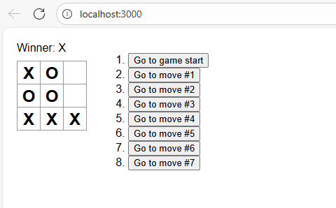

# TicTacToe

## David Espinosa

### Descripcion

---

Esta es una aplicacion web programada en javascript con React la cual permite hacer el mitico juego del tictactoe

---

### Evidencia



Con esta sebusca implementar un modo multijugador el cual permita a traves de un mecanismo de websockets una conexion concurrente

Se va a utilizar el servidor concurrente que se encuentra en: https://github.com/daviespr1406/Parcial2T_ARSW.git

este corre desde el puerto 8080 y se accede desde la direccion http://localhost:8080

## Ejecucion

Para ejecutar este servicio se utilizan los comndos de node.js

```bash
npm install
npm start
```

